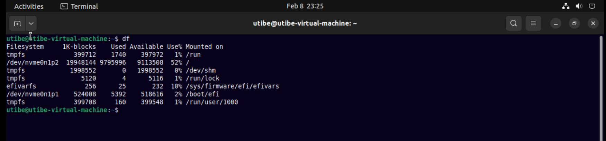
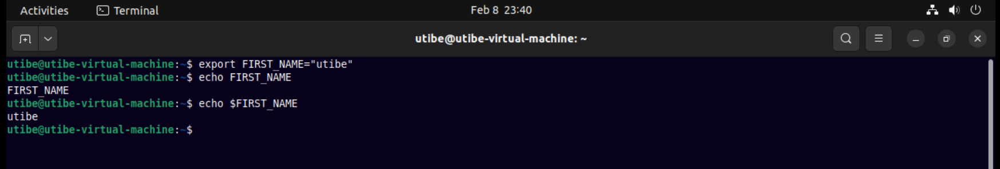
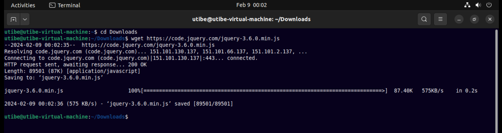
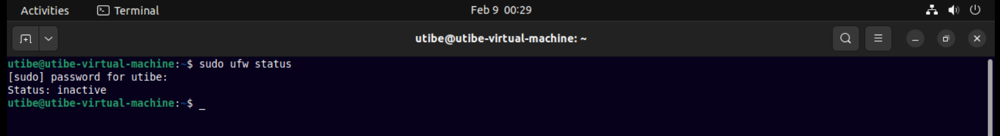
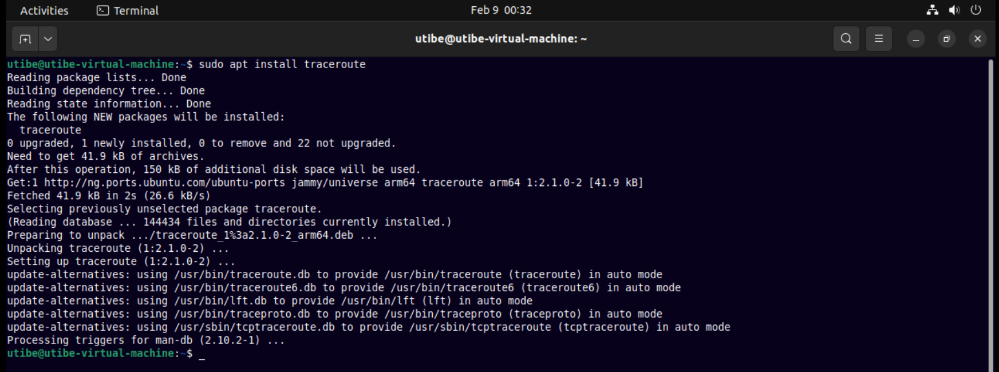
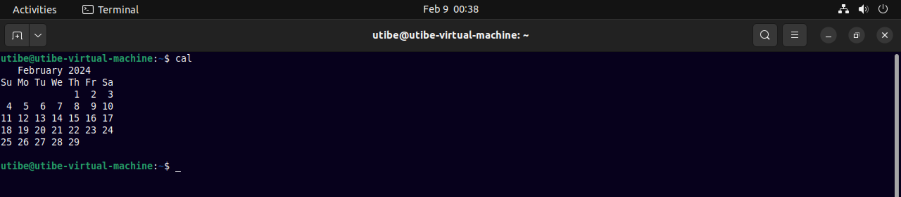
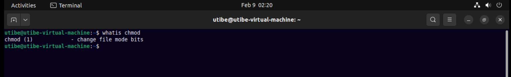
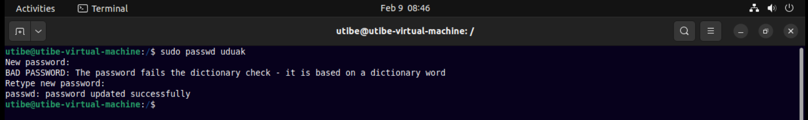

### Exercise 2
#### Task

Research online for 10 more linux commands aside the ones already mentioned in this module. Submit using your altschool-cloud-exercises project, explaining what each command is used for with examples of how to use each and example screenshots of using each of them.

__Instruction:__ Submit your work in a folder for this exercise in your altschool-cloud-exercises project. You will need to learn how to embed images in markdown files.  

#### Solution

__1. df__ - Display disk filesystem information

 

__2. export__ - Export environment variables in Linux

 

__3. wget__ - Direct download files from the internet

 

__4. ufw__ - Firewall command

 

__5. apt__ - Package manager for ubuntu linux distro

 

__6. sudo__ - Command to escalate privileges in Linux

 

__7. cal__ - View a command-line calendar

 

__8. whatis__ - Find what a command is used for 

__9. useradd__ - Add new user or change existing users data. Succesful creation of user can be checked by accessing the passws file in etc directory.

__10. passwd__ - Create or update passwords for existing users

