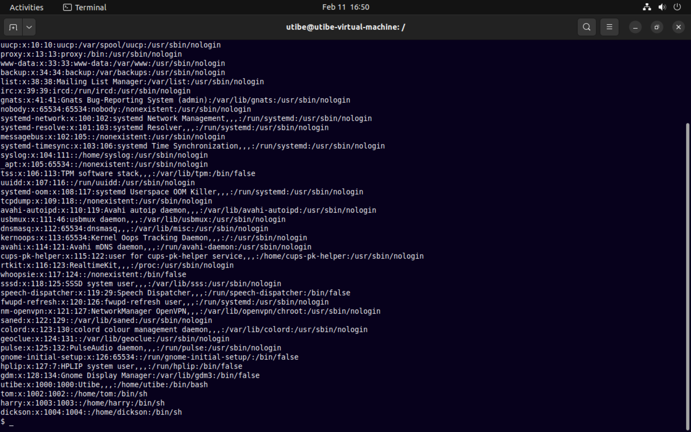
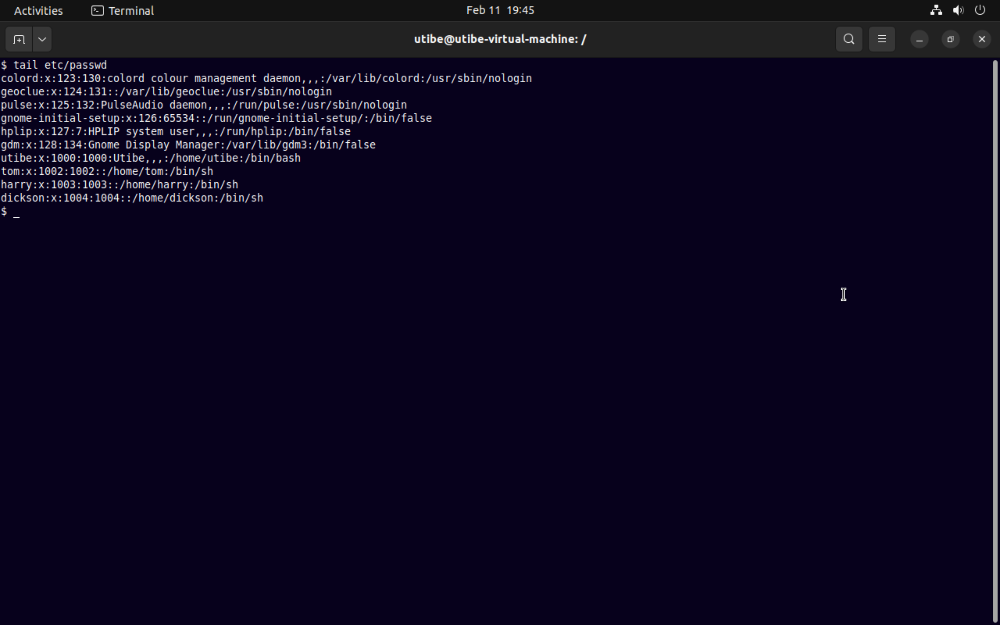
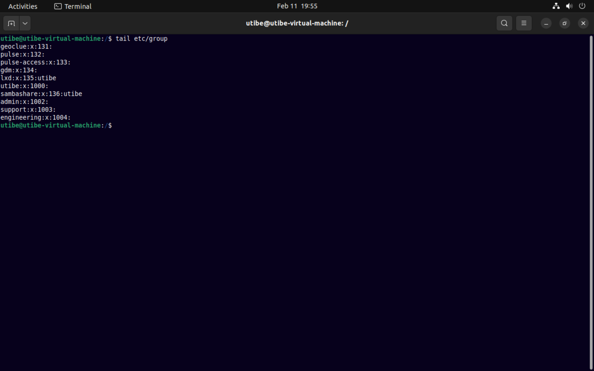
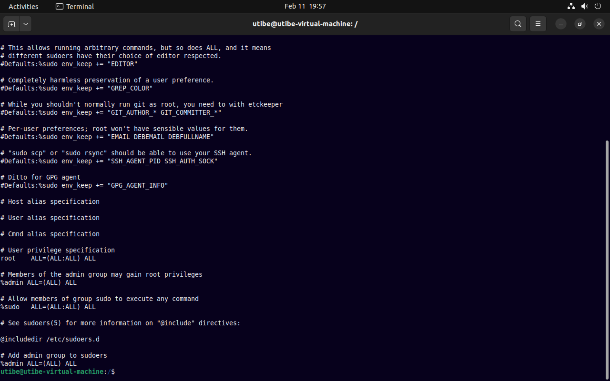

### Exercise 2 : Linux Deep Dive
#### Task
Create 3 groups – admin, support & engineering and add the admin group to sudoers. 
Create a user in each of the groups. 
Generate SSH keys for the user in the admin group

__Instruction:__
Submit the contents of /etc/passwd, /etc/group, /etc/sudoers

#### Solution

Contents of __etc/passwd__
      
     

Contents of __/etc/group__
      
     

Contents of __/etc/sudoers__
     

    