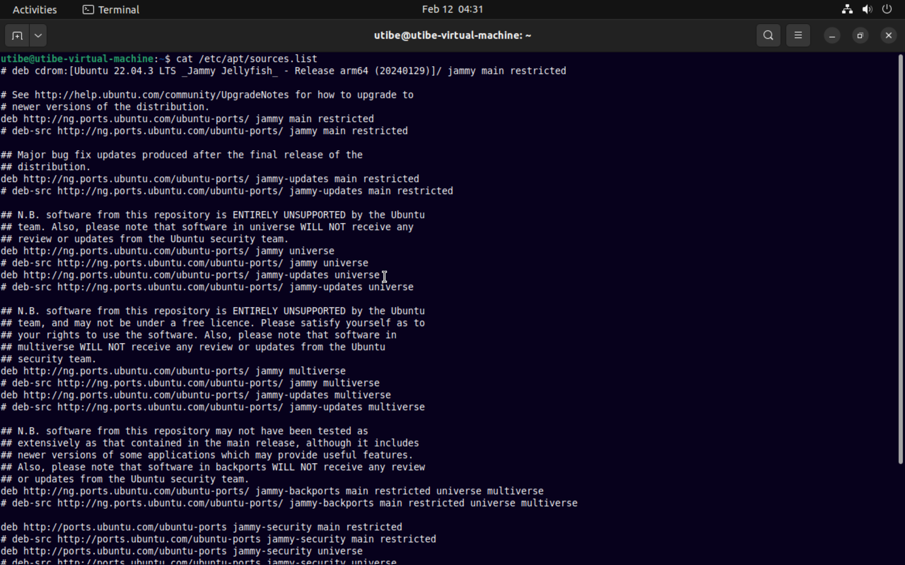
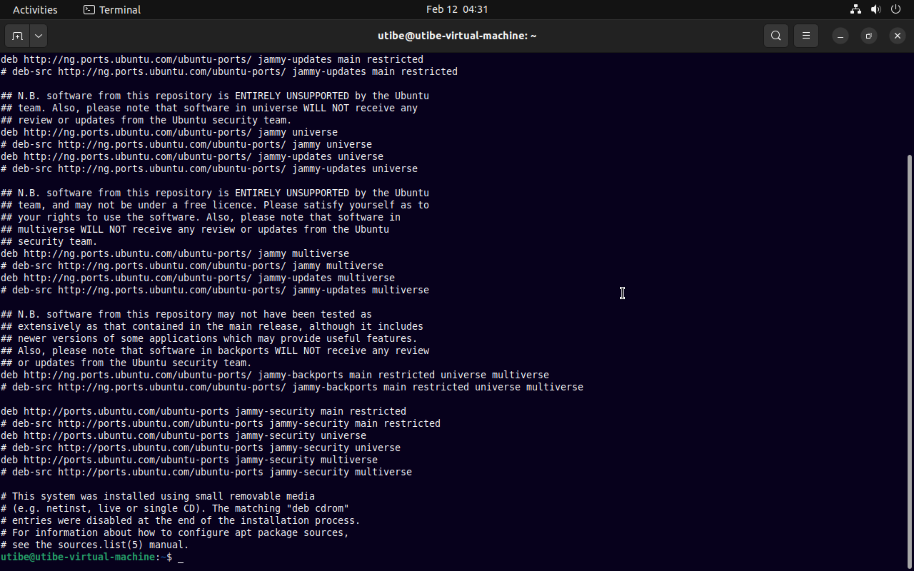

### Task : Linux Process Management:

Install PHP 7.4 on your local linux machine using the ppa:ondrej/php package repo.

#### Instruction:

Learn how to use the add-apt-repository command
Submit the content of /etc/apt/sources.list and the output of php -v command.  

#### Solution

Contents of __/etc/apt/sources.list__
     
     

Output of Php -v command
