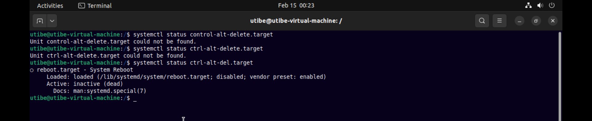
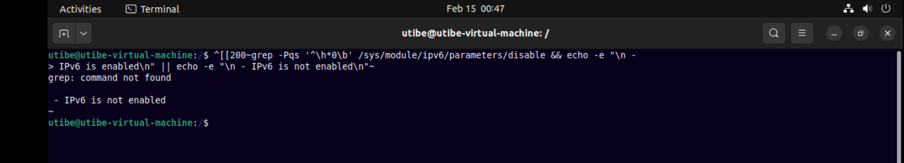
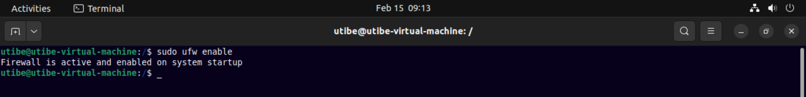
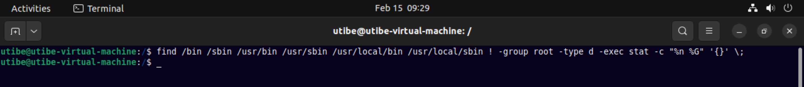
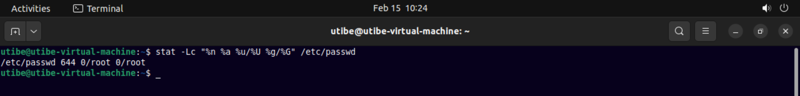
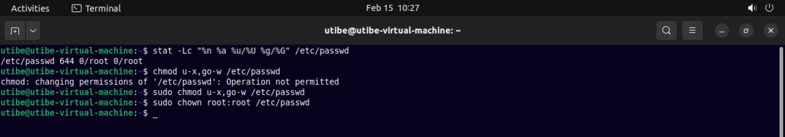
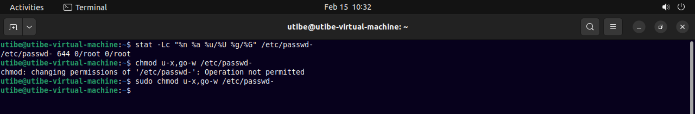
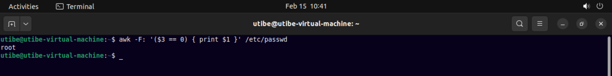
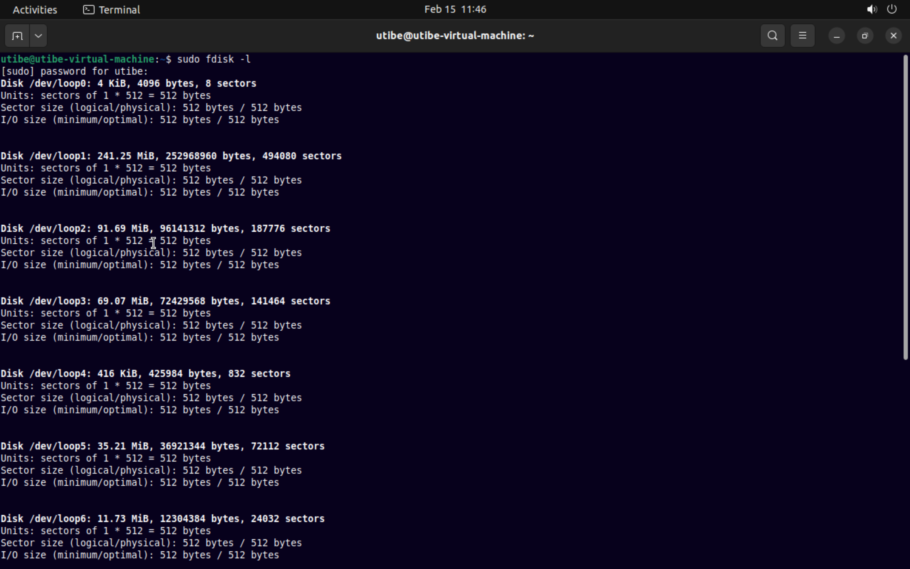

### Exercise 7 : SystemD :
* SystemD, Configuring Apache Service
* CIS Security Benchmark
* Linux Firewall

#### Task
Review CIS Benchmark for Ubuntu and try to implement at least 10 of the recommendations that were made within the benchmark.
You can practice and explore as much you can.

#### Instruction:

#### Solutions

__1.__ 1.4.9 ___Ensure the Ctrl-Alt-Delete key sequence is disabled (Automated)___

Confirming that the `ctrl-alt-del.target` (otherwise also known as reboot.target) is not active...

Here, it is inactive and hence no futher action. But if it was active, this would be a finding and the following remediation would have been used.

> .
> Set to inactive
> `sudo systemctl mask ctrl-alt-del.target`
> Reload the daemon to take effect:
> `sudo systemctl daemon-reload`
> .  

___

__2.__ 3.1.1 ___Ensure IPv6 status is identified (Manual)___

Identifying the IPv6 status

The state of this normally depends on system requirements and site policy, but it is recommended it stays as enabled.

___

__3.__ 3.4.1.3 ___Ensure ufw service is enabled (Automated)___

> .
> Verify ufw is enabled
> `systemctl is-enabled ufw`
> verify that ufw is running
> `ufw status | grep Status`
> .  

The following command enables ufw

___

__4.__ 6.1.23 ___Ensure directories that contain system commands are group-owned by root (Automated)___

Verifying the system commands directories are group-owned by root

No system commands directories are returned that are not Set Group ID up on execution (SGID) files and owned by a privileged account

If otherwise, this is a finding, and the follwing should be ran as a remediation

`
find /bin /sbin /usr/bin /usr/sbin /usr/local/bin /usr/local/sbin ! -group root -type d -exec chgrp root '{}' \;
`

___

__5.__ 6.2.1 ___Ensure accounts in /etc/passwd use shadowed passwords (Automated)___

Use this block of code to verify that accounts are shadowed:
`awk -F: '($2 != "x" ) { print $1 " is not set to shadowed passwords "}' /etc/passwd`

If not shadowed, then do this for remediation:
`sed -e 's/^\([a-zA-Z0-9_]*\):[^:]*:/\1:x:/' -i /etc passwd`

It is important to also investigate to determine if the account is logged in and what it is being used for, to determine if it needs to be forced off.

___

__6.__ 6.1.1 ___Ensure permissions on /etc/passwd are configured (Automated)___

Verifying /etc/passwd is mode 644 or more restrictive, Uid is 0/root and Gid is 0/root:

Removing excess permissions, set owner, and set group on /etc/passwd:

___

__7.__ 6.1.2 ___Ensure permissions on /etc/passwd- are configured (Automated)___

Checking for current state and then remove the permissions on /etc/passd- file

___

__8.__ ___6.2.10 Ensure root is the only UID 0 account (Automated)___

Any account with UID 0 has superuser privileges on the system. Hence, this access must be limited to only the default root account and only from the system console.

Verifying that only "root" has the UID with the following code:

`awk -F: '($3 == 0) { print $1 }' /etc/passwd`

___

__9.__ 4.5.1.6 ___Ensure ENCRYPT_METHOD is SHA512 (Automated)___

Passwords need to be protected at all times, and encryption is the standard method for protecting passwords. If passwords are not encrypted, they can be plainly read (i.e., clear text) and easily compromised.

Check the hashing algorithm that is being used to hash passwords with the following command:
`cat /etc/login.defs | grep -i encrypt_method`

> Remediation : Configure the Ubuntu operating system  to encrypt all stored passwords.
>Edit/modify the following line in the "/etc/login.defs" file and set "ENCRYPT_METHOD" to SHA512:

___

__10.__ 1.1.1.10 ___Ensure data-at-rest encryption is enabled (Manual)___

The operating systems handling data requiring "data at rest" protections must employ cryptographic mechanisms to prevent unauthorized disclosure and modification of the information at rest.

Determine the partition layout for the system with the following command:

`fdisk -l`

Verify the system partitions are all encrypted with the following command:

`more /etc/crypttab`

