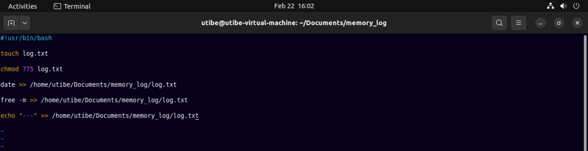
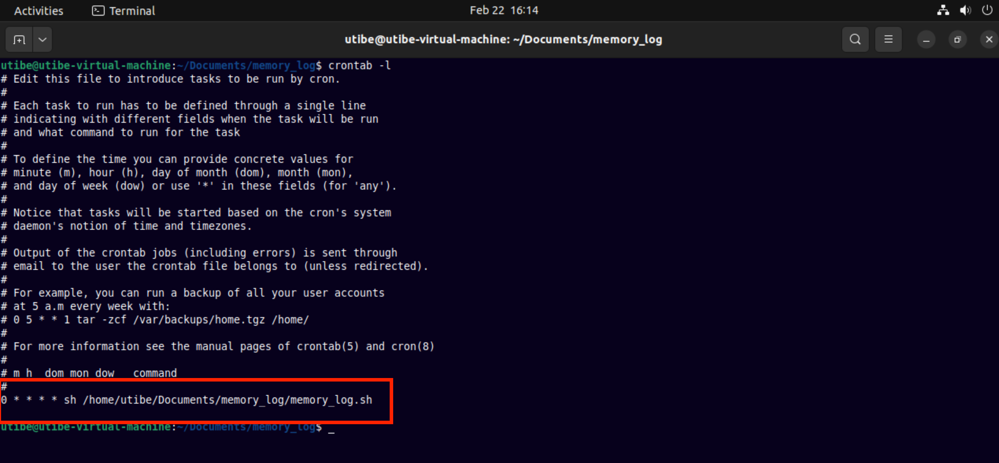

### Exercise 8 : Bash Scripting :
* Bash Scripting
* Crontab

#### Task
Create a bash script to run at every hour, saving system memory (RAM) usage to a specified file and at midnight it sends the content of the file to a specified email address, then starts over for the new day.

#### Instruction:
Submit the content of your script, cronjob and a sample of the email sent, all in the folder for this exercise.

#### Solution:

__Step1__
Bash script to get system memory usage and send the data to a file (log.txt)

___

__Step2__
Define cronjob to run the script at every hour of the day

___

__Step3__
Create another bash script (sendmail.sh) to send contents of (log.txt) to a specified email address

___

__Step4__
Define another cronjob to run the script (send_mail.sh) at the last hour of each day

___

__Alternative Method__
Using conditional statement and just one bash script.