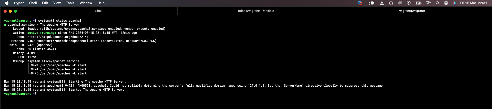

### Exercise 9 : Ansible :
#### Task

Create an Ansible Playbook to setup a server with Apache. The server should be set to the Africa/Lagos Timezone
Host an index.php file with the following content, as the main file on the server:

`<?php`
    `date("F d, Y h:i:s A e", time());`
`?>`

__Instruction:__ Submit the Ansible playbook, the output of systemctl status apache2 after deploying the playbook and a screenshot of the rendered page.

---

#### Solution
Prerequisites:
- Ansible installed on control node
- Python3 on all host nodes
- SSH connection established between machines

#### Steps
**1.** To verfiy ssh connection, I used:
`ansible servers --key-file ~/.ssh/ansible -m ping`

**2.** Create an Ansible Playbook

**3.** Run ansible-playbook command with --check flag

**4.** Take screenshot of results

--

**Command used to run the playbook:**

`ansible-playbook --key-file ~/.ssh/ansible playbook.yaml`

> Alternatively, this sould have been used if the inventory file path was not the same path I ran my ansible command from:
>> `ansible-playbook -i <path> --key-file ~/.ssh/ansible playbook.yaml`

--

#### Result Outputs

**Output of systemctl apache2**
    

**Screenshot of page**
    

---

**Difficulties and errors encountered**
- SSH connection (ansible)
Overcame it by specifying the keyfile location using the `--keyfile` flag
