## Live Class Assignment

#### Instructions
_Your login name: altschool i.e., home directory /home/altschool. The home directory contains the following sub-directories: code, tests, personal, misc Unless otherwise specified, you are running commands from the home directory._  

#### Solutions

__a.__ Change directory to the tests directory using absolute pathname
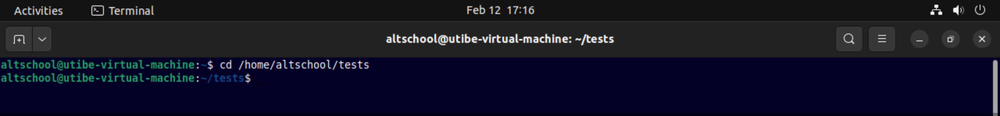

__b.__ Change directory to the tests directory using relative pathname
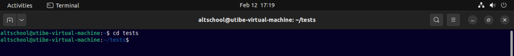

__c.__ Use echo command to create a file named fileA with text content ‘Hello A’ in the misc directory
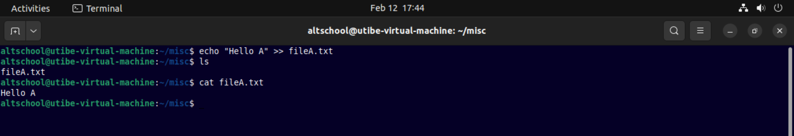

__d.__ Create an empty file named fileB in the misc directory. Populate the file with a dummy content afterwards
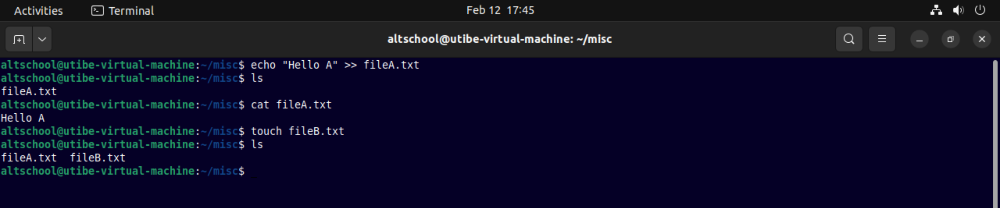
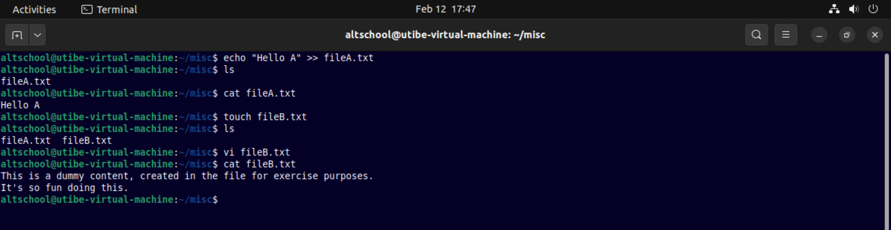

__e.__ Copy contents of fileA into fileC
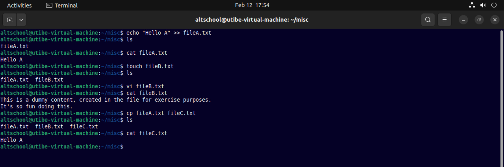

__f.__ Move contents of fileB into fileD
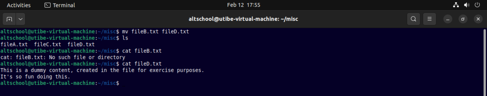

__g.__ Create a tar archive called misc.tar for the contents of misc directory
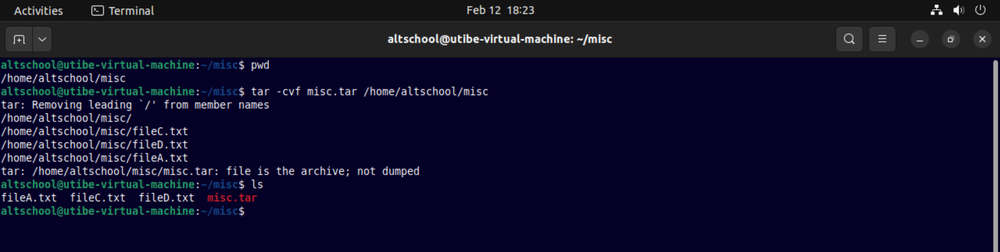

__h.__ Compress the tar archive to create a misc.tar.gz file
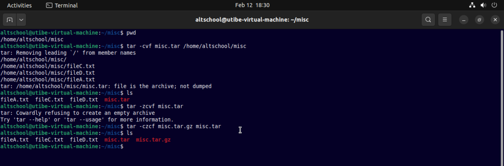

__i.__ Create a user and force the user to change his/her password upon login
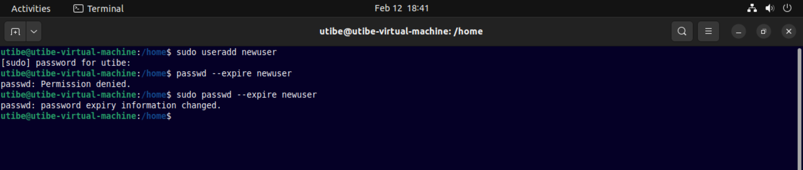

__j.__ Lock a users password
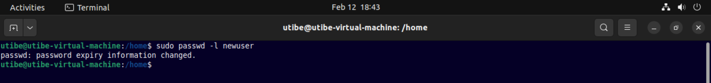

__k.__ Create a user with no login shell
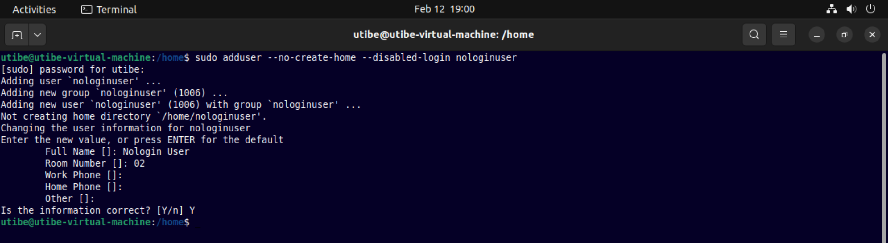
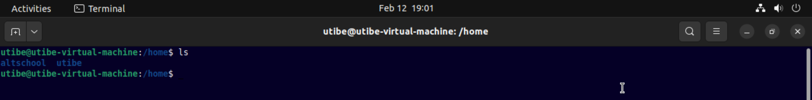

__l.__ Disable password based authentication for ssh
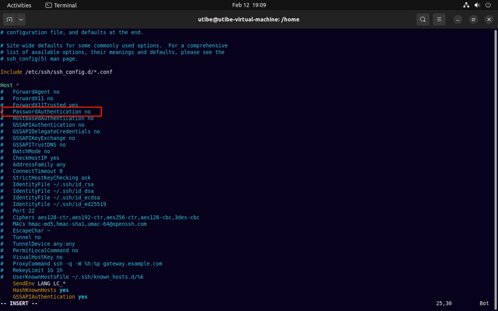

__m.__ Disable root login for ssh
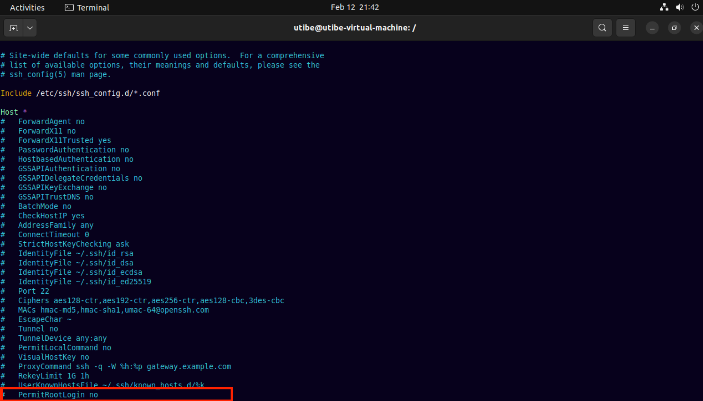
