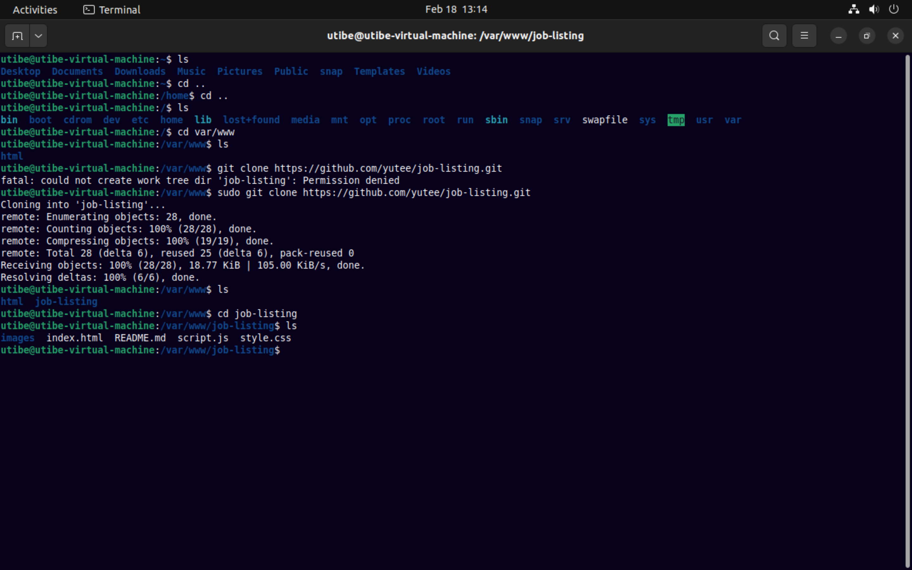
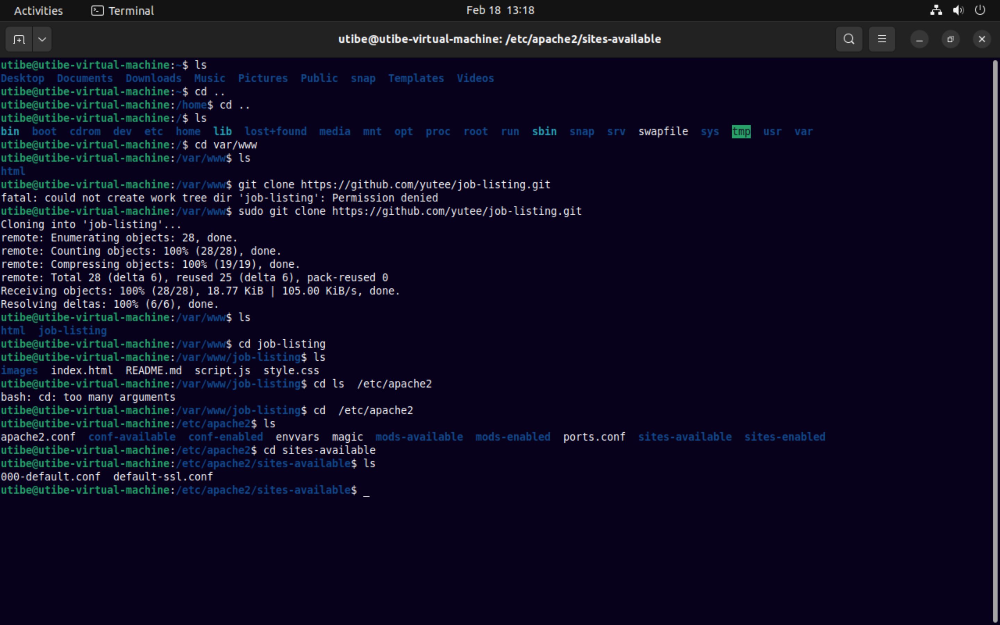
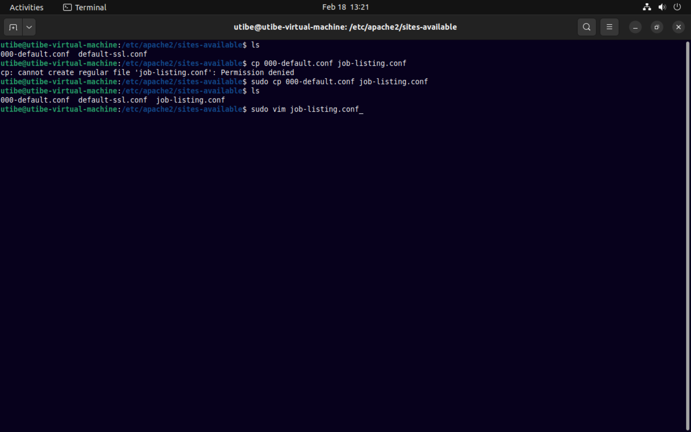
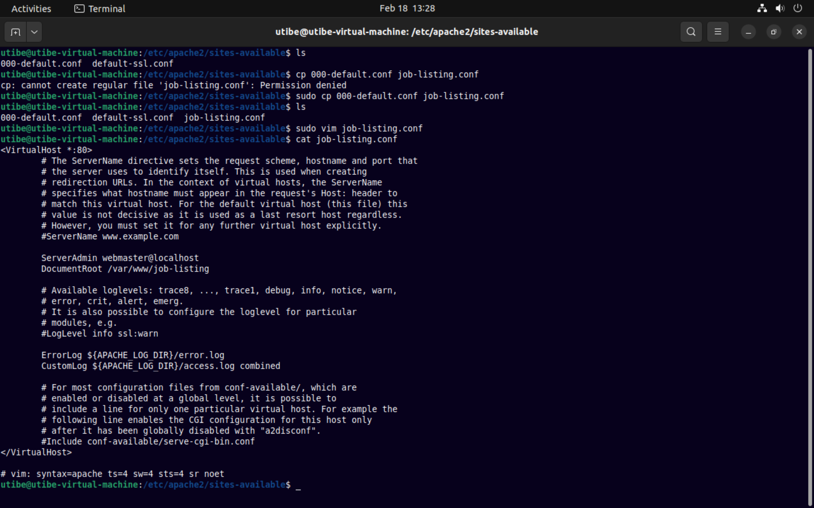
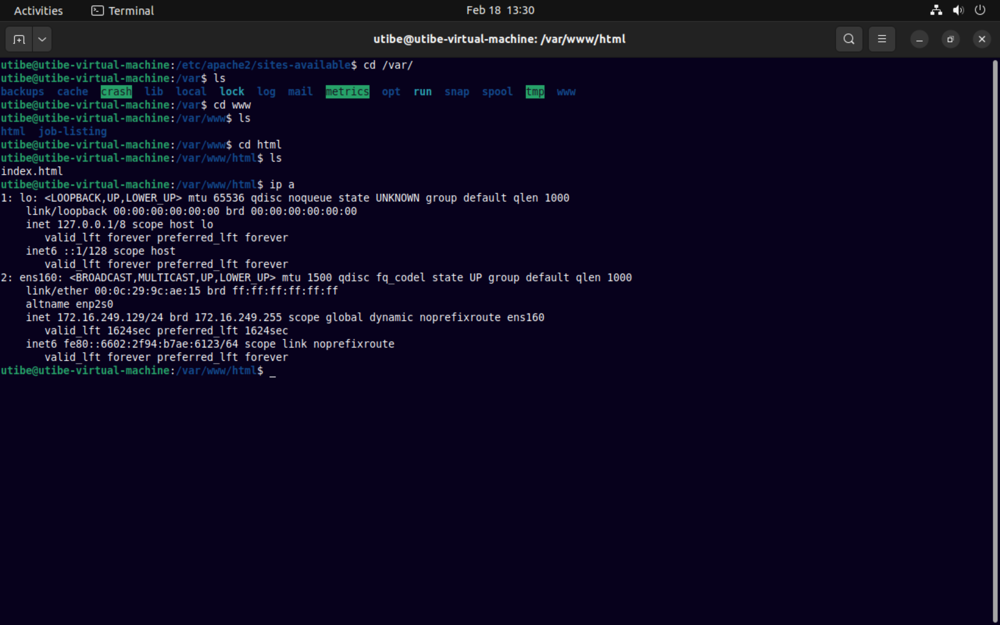
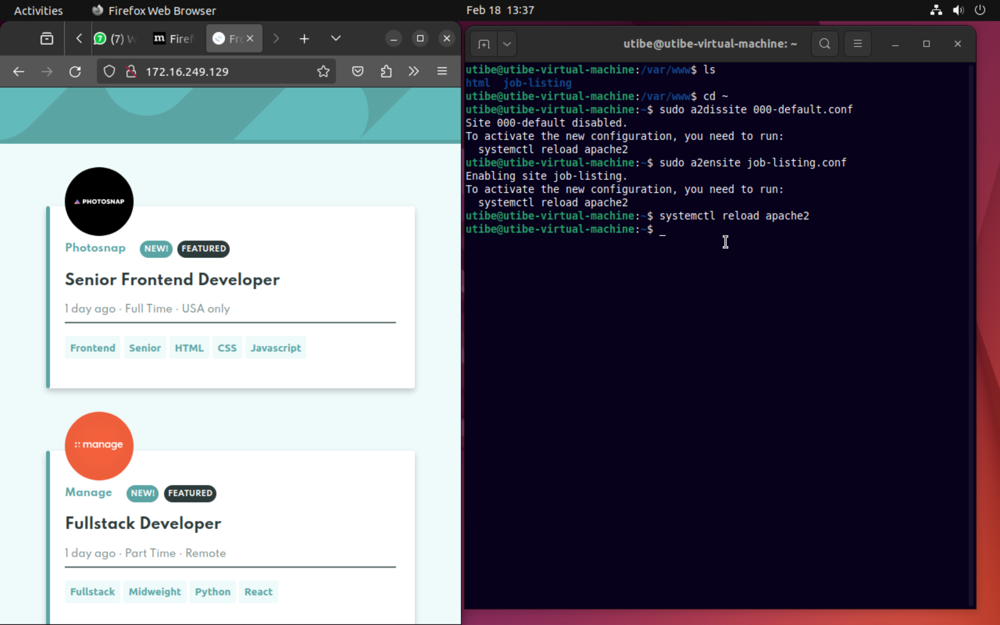

## Live Class Assignment 2

#### Instructions
_Install Apache web server and host a custom website on it. People will be called randomly next class to explain what they did._  

#### Solutions

Successfully installed Apache web server on my Ubuntu LTS 22.04 and hosted a lightweight javascript app on it.

These are the steps I took and the commands I used during the process.

__1__

___

__2__

___

__3__

___

__4__

___

__5__

___

__6__

___

