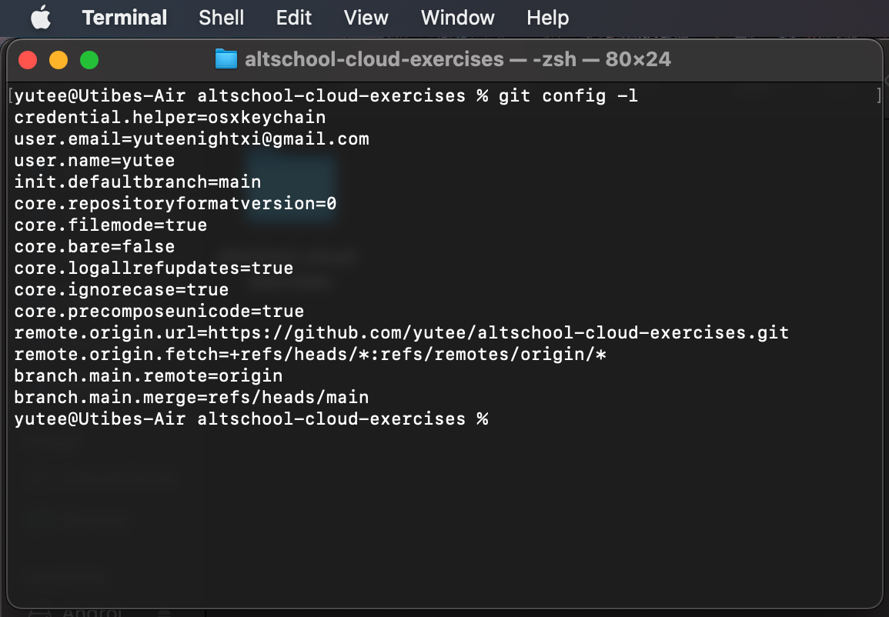
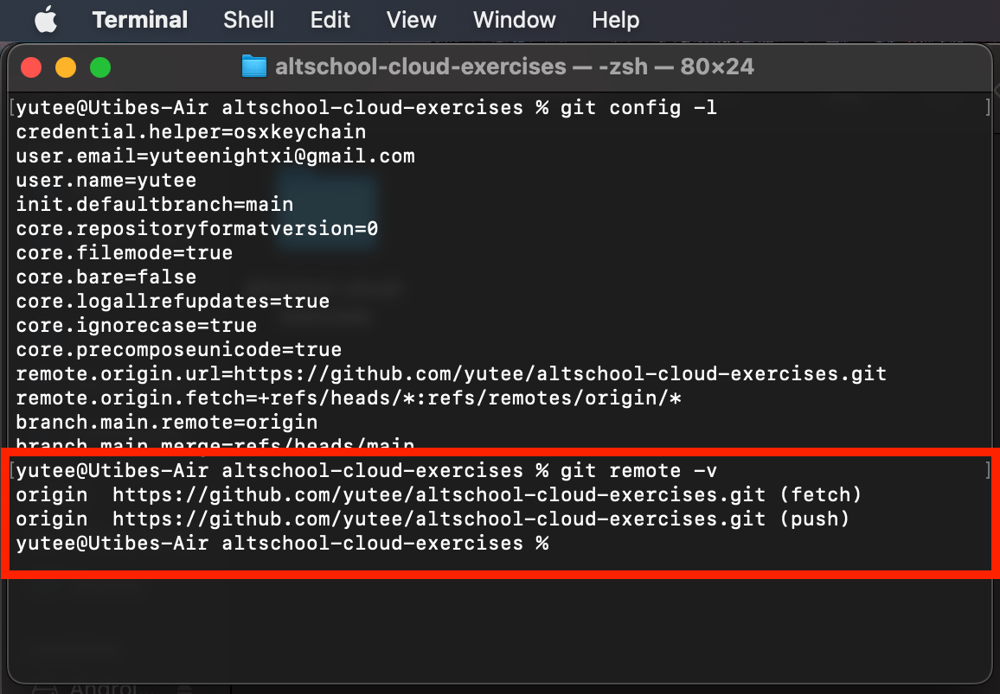
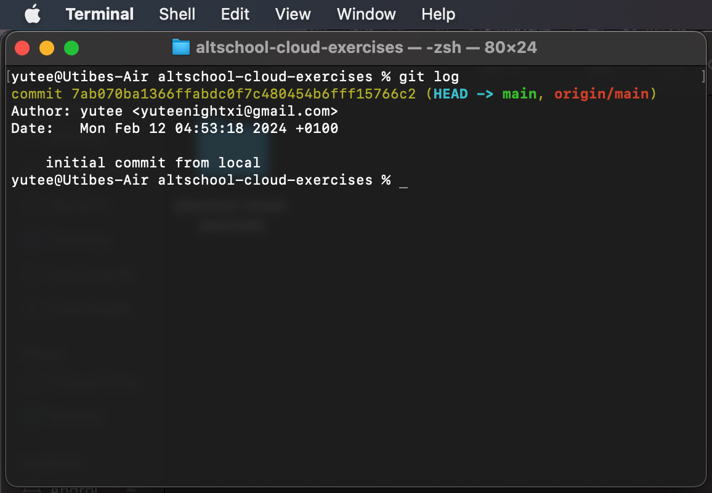

### Exercise 6 : Version Control (Git) :
#### Task

* You already have Github account, aso setup a GitLab account if you don’t have one already
* You already have a altschool-cloud-exercises project, clone the project to your local system
* Setup your name and email in Git’s global config

#### Instruction:
Submit the output of:
* git config -l
* git remote -v
* git log

#### Solution
__Output of git config -l__

__Output of git remote -v__

__Output of git config -l__
