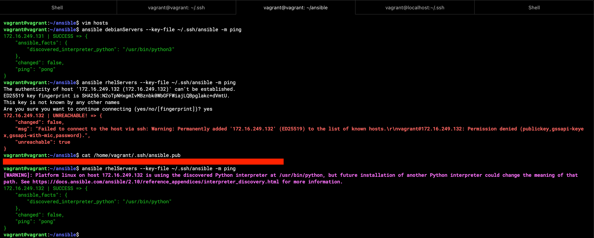
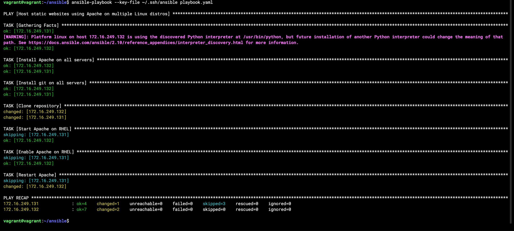
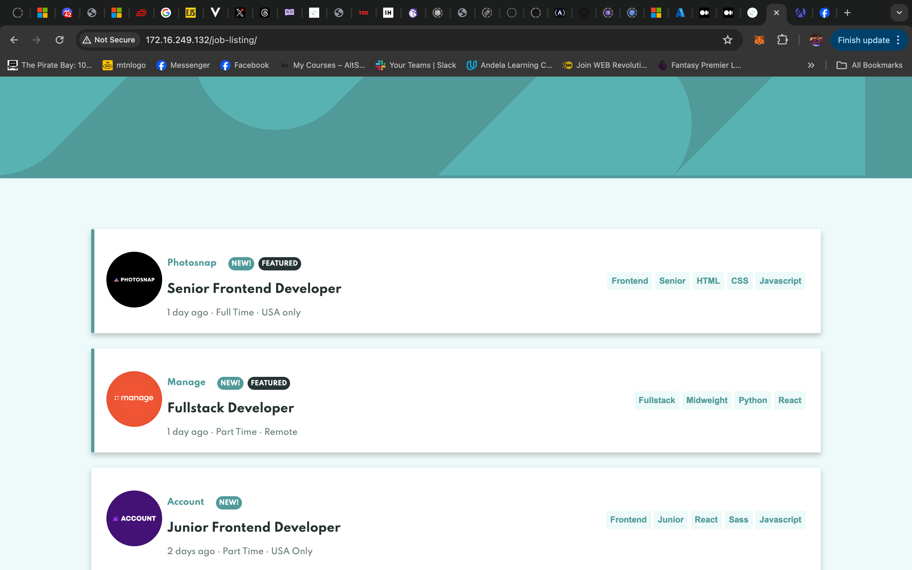
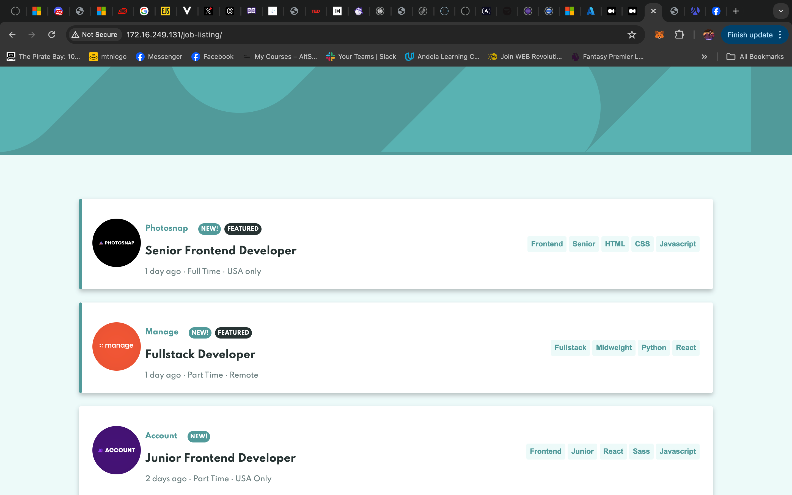

## Live Class Assignment 3

#### Instructions
Remember that task where you deployed an open source app on GitHub using Apache? you would be deploying same but this time around using ansible. Your ansible slave will consist of one ubuntu node and one centos(rhel) node. Your master node can be of any Linux distribution of your choice (3 nodes in all). Explore using variables in ansible while executing this task. You will push your playbooks to your GitHub account and submit a link to same Then we will discuss in class(probably next week Saturday)

A submission form will be shared within the coming days by __@Oshinojo Adedeji__   
And submission deadline would be on or before 6pm next Saturday.  

#### Solutions

__Steps__
1. Ensure all machines are setup. I will be using vagrant to provision Two Ubuntu machines (one as control pane) and one CentOS machine to join the other as hosts
>>
2. Define host machines in inventory file
>>
3. Generate ssh keys for ansible to use in connecting to it's hosts machine using the ED25519 public-key signature system.
>>
4. Ping hosts machines and ensure ssh connection is established via ansible

Result

>>
5. Write playbook
>>
   >> Ensure variables are used to determine which linux distro so as to determine which commands to run
   >> Clone git repo and copy to apache host folder
>>
6. Check playbook correctness using `--check` flag
>>
7. Deploy playbook using `ansible-playbook`

Results after successful deployment

>>
Hosted sites screenshot

>>

>>
8. Copy playbook to local machine, then push to github. Submit folder link.

>>
>>

__Showing files setup__
_My ansible config file_ 
>> ` [defaults] `
    ` inventory = hosts `

_My hosts file_
>> ` [debianServers] `
>> ` 172.16.249.131 apache_package_name=apache2 `
>> ` `
>> ` [rhelServers] `
>> ` 172.16.249.132 apache_package_name=httpd`

__Extra__
External variable files can be added to the playbook head using
`vars_files:`