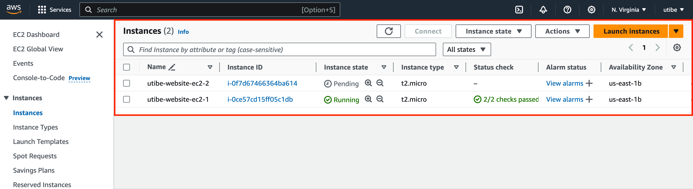
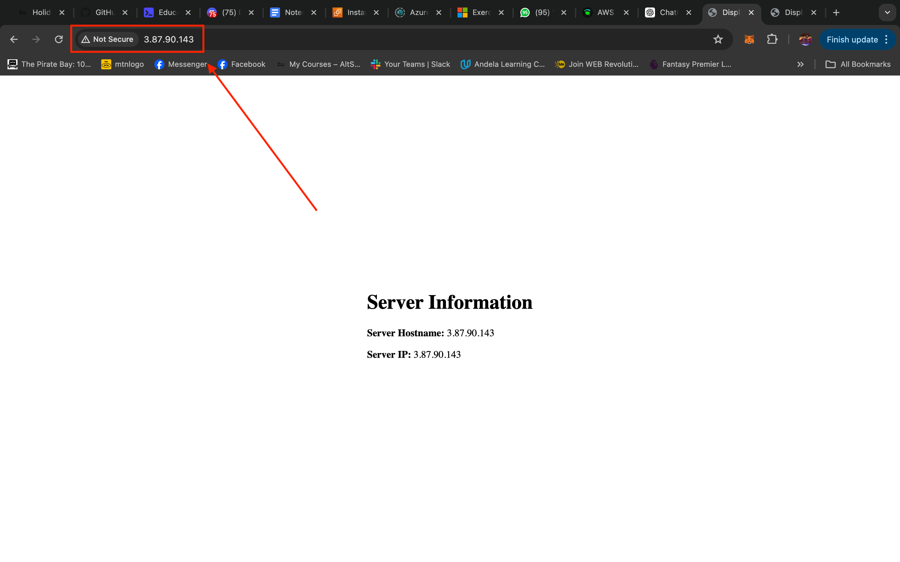
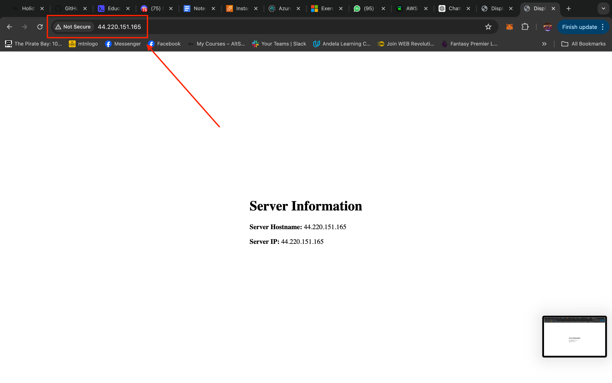

### Instruction 

You are required to perform the following tasks

- Set up 2 EC2 instances on AWS(use the free tier instances).
- Deploy an Nginx web server on these instances(you are free to use Ansible)
- Set up an ALB(Application Load balancer) to route requests to your EC2 instances
- Make sure that each server displays its own Hostname or IP address. You can use any programming language of your choice to display this.
- Work on building a personal portfolio and CV (Check out resumeworded.com).

#### Important points to note:

- I should not be able to access your web servers through their respective IP addresses. Access must be only via the load balancer
- You should define a logical network on the cloud for your servers.
- Your EC2 instances must be launched in a private network.
- Your Instances should not be assigned public IP addresses.
- You may or may not set up auto scaling(I advice you do for knowledge sake)
- You must submit a custom domain name(from a domain provider e.g. Route53) or the ALB’s domain name.

#### Submission

– Use any technical blogging platform of your choice to publish your article. 
– Make your submission through this form.

___

### Solution

#### Hosting a stateless application on multiple AWS EC2 instances running nginx servers behind Application Load balancer

what I will be doing-
steps I will be taking to do what I will be doing-

__Step 1: Setting up the instances__
An EC2 instance is a virtual server in the Amazon Elastic Compute Cloud (EC2) service. It allows you to run applications and services in the cloud. EC2 instances are highly scalable and flexible, providing you with the ability to choose the hardware configuration, operating system, and other software components.

Login into the AWS console and create two instances.

__Step 2: Deploying an Nginx server on the instances using Ansible__

Nginx is a popular web server and reverse proxy server. It is designed to handle high traffic loads and efficiently serve web content.

Ansible, on the other hand, is an open-source automation tool that simplifies the process of managing and provisioning servers. It allows you to define infrastructure as code using a declarative language.

I will be using Ansible to install nginx and then deploy my website to the two  Ec2 instances I created previously.
To use Ansible, you will need to have it installed pn your local machine and have an ssh connection with your instances. The instances will also be declared in an Inventory file. You can find out how ot acheive this using the Ansible documentation.

Note: This can also be done manually by accessing the different instances and going through the processes or creating a bash script and running it on the individual instances. You can run a script in the "Advanced Details" section when creating your instance(s). I personally find Ansible more convenient and efficient.

My playbook:

        - name: Update apt cache
        apt:
        update_cache: yes
        
        - name: Install NGINX
            apt:
                name: nginx
                state: present

        - name: Remove default nginx configuration
            file:
                path: /etc/nginx/sites-enabled/default
                state: absent

        - name: Add nginx configuration
            copy:
                src: website/static-site-config
                dest: /etc/nginx/sites-available/
                owner: root
                group: root
                mode: '0644'

        - name: Enable website configuration
            file:
                src: /etc/nginx/sites-available/static-site-config
                dest: /etc/nginx/sites-enabled/static-site-config
                state: link

        - name: Copy the HTML file to the default NGINX directory
            copy:
                src: website/index.html
                dest: /var/www/html/index.html
                owner: www-data
                group: www-data
                mode: '0644'

        - name: Ensure NGINX is started and enabled
            service:
                name: nginx
                state: started
                enabled: yes

After running the playbook, the app is successfully hosted servers:

__Step 3: Setting up an Apllication Load Balancer__
An AWS Application Load Balancer (ALB) is a service that helps manage and distribute incoming application traffic across multiple targets, such as EC2 instances, containers, IP addresses, and Lambda functions, in one or more Availability Zones.

I will be using it to manange incoming traffic to both EC2 instances running my app. Users will only have access to my load balancer, and it will in turn route requests to any of the servers hosting my application.

I will be setting up the ALB in the following steps:

- Search for Load Balancers on AWS
- From the options, select "Application Load Balancer"
- Set a unique name and leave the other defaults for the first section
- On the Network Mapping section, select a Virtual Private Cloud (create on if you do not already have) and then select at least two Availability zones
- Select a security group that will handle rules for your load balancer (create one if not already available)
- On the Listeners and Routing section, select the port (usually port 80 for HTTP) and then select a target group. Here, you most likely will not already have  a target group. Create one and add your instances to it.
- Review your selections and click "Create load balancer"
- Wait for it to finish provisioning (might take some minutes) and then visit your app using the domain name provided

Now, notice how each time you try to access the app, it is being served from either of the two instances? Great!

__Further Improvements:__

- Launch instances on a private network and they should not be assigned a public IP
- Setup auto scaling
- Use Route 53 to assign a custom domain name to to the load balancer

