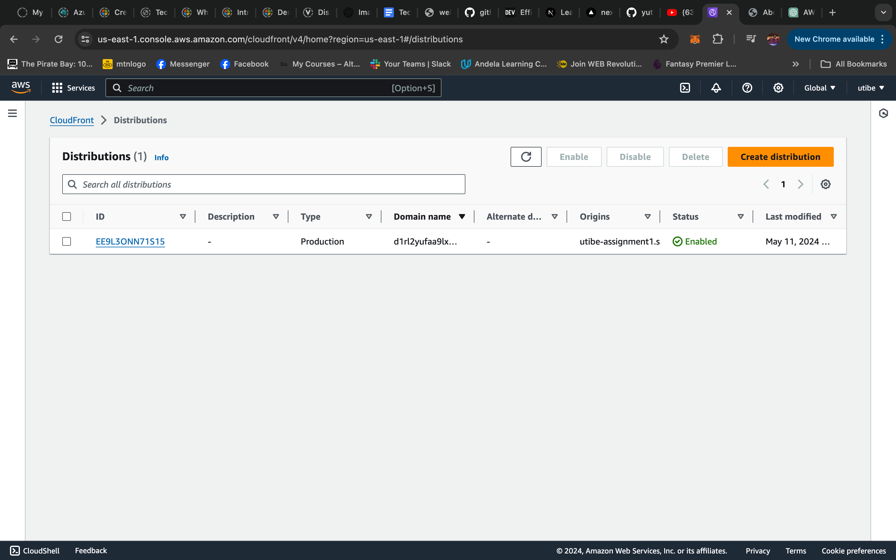

## Live Class Assignment 1

#### Instructions
_Create a static website and host it on S3 bucket (private bucket) but with public read policy assigned, using cloud front for CDN._

_To be submitted on Saturday, latest 10am with screenshots of your Aws account bearing your name._
_Input your steps and screenshots in your README file on GitHub._  

#### Solution

__Overview__
A static site is a usually made up of just HTML, CSS and Javascript files which display the same content everytime it is served, irrespective of which user it is served to.
Hosting such sites do not require full server and it's configurations. A simple storage can be used.

The Amazon Simple Storage Service commonly known as S3 for short offers a cloud based storage facility. It accepts a variety of files and can hold files of a few bytes up to terabytes in size. These files are stored as objects in the bucket and with the right permissions, and policies can be accessed at any time, from anywhere.

We can do more than just storing files with the S3 bucket as it has the capability to host static websites. And using another Amazon service called Cloudfront we can ensure our files are publicly accessible and delivered with low latency to different locations globally.

I will be showing how this can be acheived in a few steps using just...
- __An AWS Account__
- __Static Web File (Just a simple HTML file will do)__

For this task, I already have an AWS account setup and the static website available in my local machine.
___ I will be hosting a simple html website with a file name _about.html_, this will be the final result, but instead of localhost, it will be hosted online with the help of AWS S3 Bucket ___

>> 

__Step 1: Creating an S3 Bucket__
- Logging into my AWS Console.
- I searched for the S3 service and clicked on the “Create bucket” button.

I went through the creation process, I learnt that it is required for the bucket name to be globally unique and AWS priotize bucket permissions as it determines the safety of files in the bucket.

>> 

___

__Step 2: Uploading my HTML file__
- In my newly created bucket’s overview page, I clicked on the “Upload” button.
- Selected my HTML files from local machine (here, if you have any other files like images, CSS, or JavaScript files you can add them).
- Following the processes, I uploaded my file __about.html__

>> 

___

__Step 3: Configuring Bucket for Static Website Hosting__
Trying to access the uploaded file and I got this error.

>> 

This is because my bucket is private by default and I have not enabled the bucket for website hosting. To do this, I went through the following process...

- Navigated to bucket properties and select the “Static website hosting” card.
- Selected the “Use this bucket to host a website” option.
- Set my desired index file, _about.html_ in my case. (This file will be used an the entry point for the website)
- There is an option to provide an error document for better user experience but I skipped this and saved changes. 

>> 

>> 

I was provided with a link to access my website, but it was still not accessible, yet...

___

__Step 4: Adding public read policy for the bucket__
There are a few more configuations to be done for the website to be publicly accessible. This is making the bucket objects public using bucket policy.

- I navigated to the “Permissions” tab and under the “Block public access” section, clicked “Edit.”
- I ensured all block settings are disabled (this depends on my security needs, and it is still the same as it was when I created the bucket).
- Scrolled down to the “Bucket policy” section and click “Edit.”
- Using the following bucket policy template I made some changes to my bucket policy.

>> 

>> 

At this point, my website should be publicly accessible.

>> 

___

__Step 5: Creating a CloudFront Distribution__

Even though the website is up and running on the cloud, it has a "Not Secure” tag which means it is not secured but with Cloudfront, securely serve our website content. Using Cloudfront also helps....

- Navigating to the CloudFront service in the AWS Console I clicked “Create Distribution.”
- I configured the following settings:
>> - __Origin Domain Name:__ Select your S3 bucket from the dropdown.
>> - __Origin Path:__ Left this empty.
>> - __Viewer Protocol Policy:__ Redirect HTTP to HTTPS (or adjust based on your needs).
>> - __Allowed HTTP Methods:__ GET, HEAD.
>> - __Compress Objects Automatically:__ Yes.

- Kept the settings on default and clicked “Create Distribution.”
>> 

Distribution has been created. It takes a bit of time for this to complete.

>> 

>> 

There... My website is up and running and distributed by AWS Cloudfront and fully accessible via a domain name provided by Cloudfront.

>> 

Additionally using a custom domain name is supported and can be an extra step to personalization, but that is outside the scope of this task.